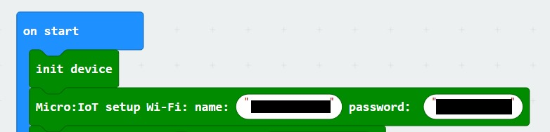
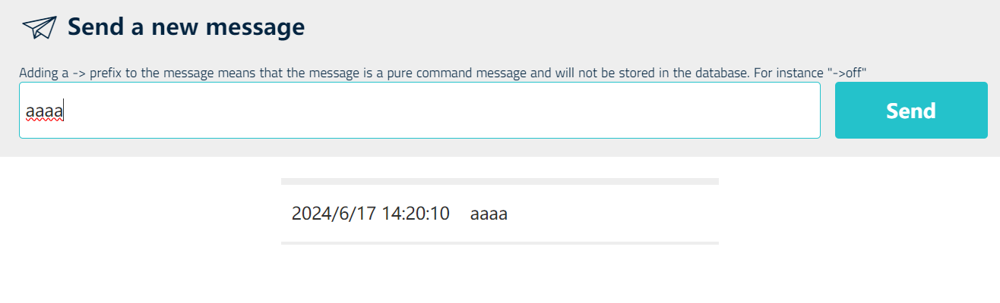

# Microbit internet communication system

Send and receive data with Microbit board over the internet using the DFRobot wifi expansion board. 

> Open this page at [https://crash1999.github.io/wifi_test/](https://crash1999.github.io/wifi_test/)

## Use as Extension

This repository can be added as an **extension** in MakeCode.

* open [https://makecode.microbit.org/](https://makecode.microbit.org/)
* click on **New Project**
* click on **Extensions** under the gearwheel menu
* search for **https://github.com/crash1999/wifi_test** and import

## Edit this project

To edit this repository in MakeCode.

* open [https://makecode.microbit.org/](https://makecode.microbit.org/)
* click on **Import** then click on **Import URL**
* paste **https://github.com/crash1999/wifi_test** and click import

#### Metadata (used for search, rendering)

* for PXT/microbit

## Getting started

The DFRobot micro:IoT is an affordable expansion board based on the microbit; it has several feature that makes it a good solution for education about IoT. It can be found at https://www.dfrobot.com/product-1926.html?tracking=5d9d760421f87
The board offers 3 pin connectors for the GPIO and 2 wire connectors for DC motor, I2C interface, RGB LEDs and an OLED display. 

## Internet connection

The board connects easily at the microbit and it makes it possible (according to the manufacturer) to communicate via IFTT, Thingspeak, and a DFRobot server. All of the possibilities were tested and the aim of this work is to show how to send and receive data in the easiest way and what are the limits of this system. 

The expantion board connects to WiFi with the dedicated block "setup WiFi name and password" but it can connect only to 2.4 GHz WiFi; this is not addressed by the manufacturer but the connection to a 5 GHz network will fail (the LED indicator will be red). 

## Sending data

The easiest way to send data to a server is to use the DFRobot server. The server requires the setup of an account that has to be setup via phone number because entering an email will lead to a page where a Chinese phone number is required. Once the account is set up, there is the possibility to open the topics: a topic is a container for the data that are communicated with a device. 

On the Microbit there is the MQTT setup to initialize this communication.

After the Micro:bit is connected with the server only strings can be sent as a message.

The message can be sent at 100ms delay without any problem in this way.

On the topic of the server page, there is the possibility to plot a graph of the data and there is also the possibility to download the data as an [exel](https://github.com/crash1999/wifi_test/blob/master/Easy%20IOT%20Micro_bit%20Date%202024_06_17%2015_00%202024_06_18%2016_00%20Key%20undefined.xlsx) file. 

## Receiving data

On the DFRobot server, there is the possibility to send a message to the microcontroller; the message can be sent only manually and there is no possibility to insert some script to send it automatically. 

This is a limitation for the IoT application because this makes impossible the communication between two Microbit. 
Anyway, it is possible to send a string to the microcontroller its topic. 

## Sending and Receiving

It is possible to send and receive data on the same microbit in the same script; unfortunately, this has to work on the same topic. It is not possible to communicate or receive data from different topics in the same script (for example sending data on topic 0 and receiving it on topic 1) and there is no workaround for this because the DFRobot server is designed to think of one topic as one device. 
Also, another problem with sending and receiving the message is that when the message is sent it will arrive correctly to the server but the microbit will see a ghost message that is sent back from the server (in reality the server is not sanding anything) that contains exactly the string that was sent. This can be handled by sending numbers and checking if the received message is a number, then discarding it; in this way, letters can be used as data sent from the server to the microbit. 

## Other communication protocols

The manufacturer states that it is possible to use IFTTT and Thingspeak; none of these are free to use. Some educational institution has access to Thinkgspeak, but it is not easier than the DFRobot server. Also with this expansion board, it is not possible to use internet with different protocols or connect to other servers because the firmware is missing. It is not possible also to ping another device on the local network, making the application for this device very limited. It is possible to not use this board but to connect to a PC via Bluetooth or USB and send data to a web app that runs on the PC; in that way, it is possible to overcome all the limits of this expansion board. Building a web app is not recommended to a beginner and so it is out of the scope of this work. A similar work that uses a web app made with GoogleSheet can be found at https://github.com/ferrygun/micro-bit-GoogleSheets

## Code Blocks

This program implements the communication via MQTT with the DFRobot server; in the on start block, there is all the initialization: all the files have to be populated by the personal data of the user (WiFi and DFRobot server account). After the initialization the program will send data that are numbers from 0 to 100 to the server and a plot similar to the one at the beginning can be produced. There is also the possibility to interrupt this data and send a custom value by pressing the button A; in this case, the custom value is 10 but it can be any character because it is a string. Also, there is the part where a message from the server can be captured, which is on the same topic then the data sent; it is not possible to send and receive data on different topics. For debugging1 reasons the messages are printed on the OLED display and in this way they are printed the ghost messages that are captured from the data sent and not from the server. 

